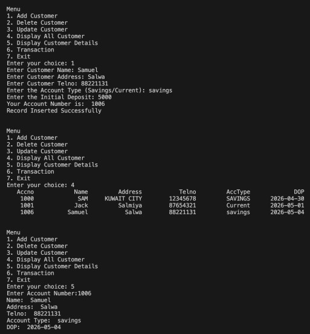
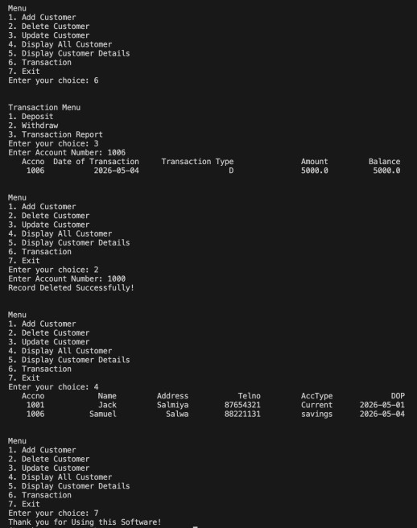

# Bank Management System

This is terminal based banking application built with Python and MySQL. That supports operations including account management, deposits, withdrawals, and transaction history.

## Features

- Create, update and delete customer accounts
- View all the customer and also their individual details
- Deposit and withdrawal with full transaction history for each account
- Supports Savings and Current account
- Savings account must maintain a minimum balance of 100

## Tech Stack

Python - PyMySQL - MySQL

## Setup & Run

- Clone the repository
```

git clone https://github.com/Samufds/Bank-Management-System.git

```
- Create a MySQL database "bank"
- Create the required tables (As shown in "database.sql")
- Install pymysql (Use: pip install pymysql)
- To Run (Use: python bank.py)

## Preview

  
  


